# HW5 (Incomplete Top Testbench)
## Code Summary
The following top module code designs a transmitter/reciever using a FPGA and coded with an FSM structure. The main idea of the code
is to recieve data via uart from PC and store 4 bytes into 4 registers, Address High, Address Low, Data High, and Data Low and square 
root the data. Then send the data back to the PC via uart. The code has 11 states: IDLE, RECEIVE_AH, RECEIVE_AL, RECEIVE_DH, RECEIVE_DL,  
PROCESS_CORDIC, READ_RAM, WRITE_RAM, SEND_HIGH, BUFFER, and SEND_LOW. The IDLE state is the default state where all flags are zero and
will only move onto next state when data is recieved. RECEIVE_AH, RECEIVE_AL, RECEIVE_DH, and RECEIVE_DL are the states that store the 
data from the reciever. Recieving the data requires the use of flags such as "rx_empty" that indicates when data is loaded onto "rx_data".
The code uses rx_empty to determine when to move onto next state after storing the data. PROCESS_CORDIC is where the data gets square rooted
WRITE_RAM is where the data outputed from the cordic module is stored into the ram. The WRITE_RAM state makes sure the write enable flag is on
and the output (from cordic) is valid before it stores the data into the ram. READ_DATA is where the old data from the ram is stored into a
register for later output. READ_DATA makes sure writing is disabled because it stores the old data outputted from the RAM. SEND_HIGH and 
SEND_LOW is where the old data from the ram is transmitted back to the PC. The two states rely on the "tx_empty" flag to make sure the data is
ready to send. The BUFFER state is used to reset the "ld_tx_data" setting it from "1" to "0" this is done to reinitiate sending the lower 8 bits
to the PC.
## Top Module Code
~~~systemverilog
module top (
    input clk,
    input rx_in, 
    output tx_out,
    input rst
);
    // UART Interface
    logic [7:0] rx_data;
    logic rx_empty, tx_empty;
    logic uld_rx_data, ld_tx_data;
    logic [7:0] tx_data;
    logic rx_enable, tx_enable;
    
    //CORDIC Interface
    logic m_axis_dout_tvalid;
    logic [15:0] m_axis_dout_tdata;
    logic [15:0] s_axis_cartesian_tdata;
    logic s_axis_cartesian_tvalid;
    
    // RAM Interface
    logic wea;
    logic [15:0] dataIn;
    logic [15:0] dataOut;
    logic [15:0] mem_address;
    
    //FSM States
    typedef enum logic [3:0] {
        IDLE, 
        RECEIVE_AH, 
        RECEIVE_AL, 
        RECEIVE_DH, 
        RECEIVE_DL,  
        PROCESS_CORDIC,
        READ_RAM, 
        WRITE_RAM,
        SEND_HIGH,
        BUFFER,
        SEND_LOW
    } state_t;
    
    state_t current_state;
    
    // Temp vectors to store data.
    logic [15:0] old_data, new_data;  
    
    // FSM State Transitions
    always @(posedge clk, posedge rst) begin 
        // Resets registers and data.
        if (rst) begin 
            mem_address <= 16'b0;
            new_data <= 16'b0;
            old_data <= 16'b0;
            uld_rx_data <= 1'b0;
            ld_tx_data <= 1'b0;
            tx_data <= 8'b0;
            wea <= 1'b0;
            dataIn <= 16'b0;
            s_axis_cartesian_tdata <= 16'b0;
            s_axis_cartesian_tvalid <= 1'b0;
            current_state <= IDLE;
        end else begin 
            // Case statements.
            case (current_state) 
                // Idle sets flags to 0.
                IDLE: begin 
                    uld_rx_data <= 1'b0;
                    ld_tx_data <= 1'b0;
                    wea <= 1'b0;
                    s_axis_cartesian_tvalid <= 1'b0;
                    // Only moves on if rx_in has recieved data.
                    if (~rx_empty) begin 
                        current_state <= RECEIVE_AH;
                    end 
                    else begin
                        current_state <= IDLE;
                    end
                end
                // Receives the high address.
                RECEIVE_AH: begin 
                    uld_rx_data <= 1'b1;  // Allows data to go to rx_data
                    mem_address[15:8] <= rx_data;  // Stores in high bits of mem_address.
                    // Moves onto next state only if data was loaded.
                    if (~rx_empty) begin
                        current_state <= RECEIVE_AL;
                    end
                    else begin
                        current_state <= RECEIVE_AH;
                    end
                end
                // Recieves the low address.
                RECEIVE_AL: begin 
                    uld_rx_data <= 1'b1;
                    mem_address[7:0] <= rx_data;  // Stores in low bits of mem_address.
                    if (~rx_empty) begin
                        current_state <= RECEIVE_DH;
                    end
                    else begin
                        current_state <= RECEIVE_AL;
                    end
                end
                // Recieves the high bits of data.
                RECEIVE_DH: begin 
                    uld_rx_data <= 1'b1;
                    new_data[15:8] <= rx_data;  // Stores in high bits of data_store.
                    if (~rx_empty) begin
                        current_state <= RECEIVE_DL;
                    end
                    else begin
                        current_state <= RECEIVE_DH;
                    end
                end
                // Recieves the low bits of data.
                RECEIVE_DL: begin 
                    uld_rx_data <= 1'b1;
                    new_data[7:0] <= rx_data;  // Stores in low bits of data_store.
                    // Moves on when all data is unloaded.
                    if (rx_empty) begin
                        current_state <= PROCESS_CORDIC;
                    end
                    else begin
                        current_state <= RECEIVE_DL;
                    end
                end
            
                // Square roots the data.
                PROCESS_CORDIC: begin 
                    s_axis_cartesian_tvalid <= 1'b1;  // Makes it valid so value can be square rooted.
                    s_axis_cartesian_tdata <= new_data;  // Data to be square rooted.
                    current_state <= WRITE_RAM;
                end
                // Writes new data into RAM. 
                WRITE_RAM: begin 
                    wea <= 1'b1; // Enables writing
                    s_axis_cartesian_tvalid <= 1'b0;  // Turns the square root off.
                    // If the data outputed from CORDIC is valid.
                    if (m_axis_dout_tvalid) begin
                        dataIn <= m_axis_dout_tdata;  // Stores the data into RAM.
                        current_state <= READ_RAM;
                    end
                    else begin
                        current_state <= WRITE_RAM;
                    end   
                end
                // Collects data from RAM to send out.
                READ_RAM: begin 
                    wea <= 1'b0;  // Disables writing so data can be read.
                    old_data <= dataOut; // Stores data from RAM previously to old_data.
                    current_state <= SEND_HIGH;
                end
                // Sends the high bits of old data.
                SEND_HIGH: begin 
                    tx_data <= old_data[15:8];  // Sends high bits first.
                    // Makes sure transmitter is ready to send new value.
                    if (tx_empty) begin 
                        ld_tx_data <= 1'b1;  // Readies the data to be sent.
                        current_state <= BUFFER;
                    end
                    else begin
                        current_state <= SEND_HIGH;
                    end 
                end
                // Buffer to reload the ld_tx_data.
                BUFFER: begin
                    // Makes sure no new data is loaded until transmitter is empty again.
                    if (~tx_empty) begin 
                        ld_tx_data <= 1'b0;  // Stopes data to be sent.
                        current_state <= SEND_LOW;
                    end
                    else begin
                        current_state <= BUFFER;
                    end 
                end
                // Sends the lower bits
                SEND_LOW: begin 
                    tx_data <= old_data[7:0];
                    if (tx_empty) begin 
                        ld_tx_data <= 1'b1;
                        current_state <= IDLE;
                    end
                    else begin
                        current_state <= SEND_LOW;
                    end 
                end
                             
            endcase
        end
    end

// Uart module
uart uart_mod (
  .reset(rst),    // input wire rst
  .ld_tx_data(ld_tx_data), // initiate load 8 bits and send if ready to send
  .tx_data(tx_data), // internal data 8 bit to send
  .tx_enable(1'b1), // typically just set to 1
  .tx_out(tx_out), // external communication line 1 bit 
  .tx_empty(tx_empty), // indicated finished send and ready to send new value
  .clk(clk),
  .uld_rx_data(~rx_empty), // move new internal data to show up on rx_data
  .rx_data(rx_data), // internal data 8 bit receive
  .rx_enable(1'b1), // usually just set to 1
  .rx_in(rx_in), // external communication line 1 bit 
  .rx_empty(rx_empty)         // recieved serial data has been unloaded to rx_data output register, leaving room for new input serial byte
);

// Where the data is square rooted.
cordic_0 square_rooted (
  .aclk(clk),                                        // input wire aclk
  .s_axis_cartesian_tvalid(s_axis_cartesian_tvalid),  // input wire s_axis_cartesian_tvalid
  .s_axis_cartesian_tdata(s_axis_cartesian_tdata),    // input wire [15 : 0] s_axis_cartesian_tdata
  .m_axis_dout_tvalid(m_axis_dout_tvalid),            // output wire m_axis_dout_tvalid
  .m_axis_dout_tdata(m_axis_dout_tdata)              // output wire [15 : 0] m_axis_dout_tdata
);
// The RAM
blk_mem_gen_0 ram (
  .clka(clk),    // input wire clka
  .ena(1'b1),      // input wire ena
  .wea(wea),      // input wire [0 : 0] wea
  .addra(mem_address[11:0]),  // input wire [11 : 0] addra
  .dina(dataIn),    // input wire [15 : 0] dina
  .douta(dataOut)  // output wire [15 : 0] douta
);
endmodule
~~~
## Top Module Outputs
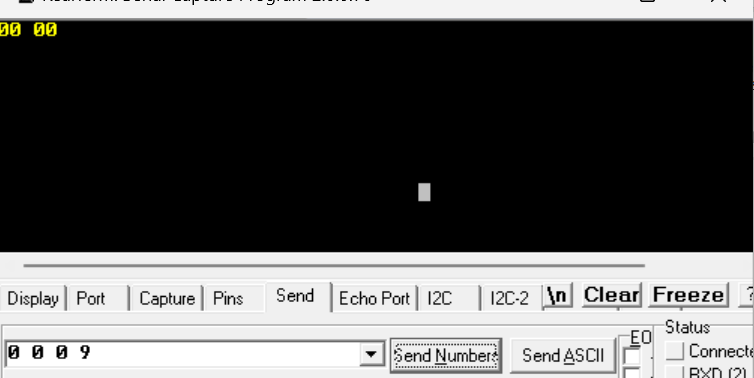 
This output should be zero because the first time data is sent there is no data in the RAM.
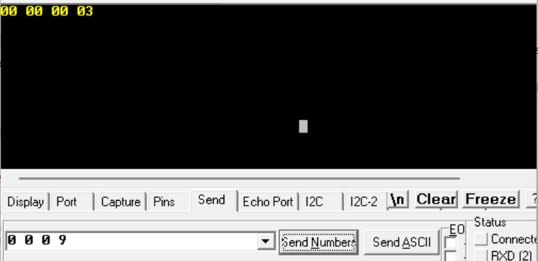 
The output is now "00 03" because it has sent out the previous inputs square rooted data.
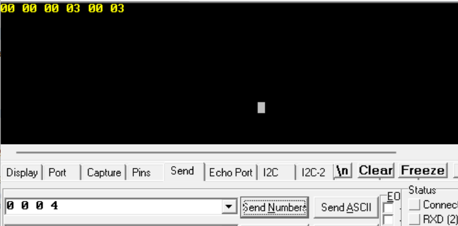 
The output is still "00 03" because it sent out the previous inputs square rooted data.
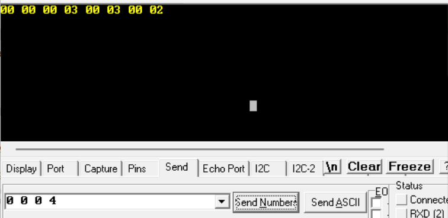
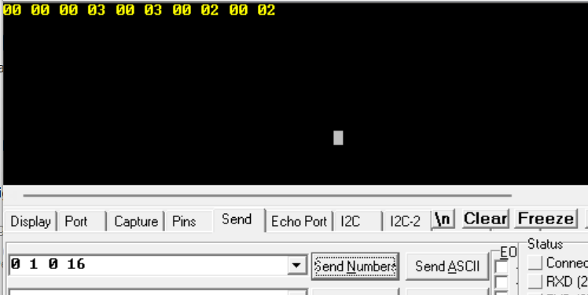
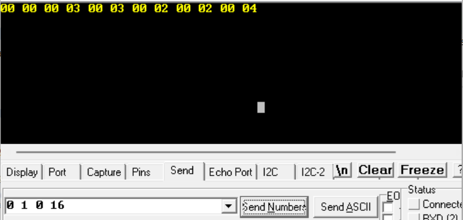 
These are some more outputs with several inputs.
## Testbench Results
## Top Module Results
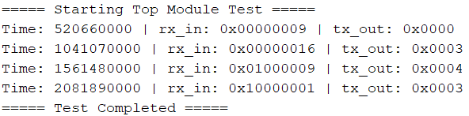 
The following image shows the outputs from the top module testbench. The testbench mimics the behavior
from the actual FPGA testing. The first output is "0x0000" because there was no data in the ram before
the first input. After the second input was transmitted to the top module, then the square rooted data
from the previous input was outputted because the RAM in the top always outputs the results obtained from 
previous inputs.
### CORDIC Module Results
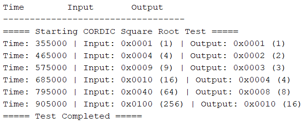 
The following image shows the outputs of the cordic module. The outputs are delayed because of the non-blocking assignment used.
The outputs are as expected where it is the square root of the inputs (delayed by one clock cycle).
### RAM Module Results
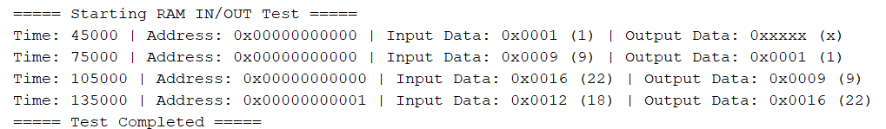 
The following image shows the outputs of the blk_mem_gen module. The module always outputs the old data so at first the module 
outputs undetermined data because there was no old data before. Then the module outputs the previous data stored which is what 
it's suppose to do.
### UART Module Results
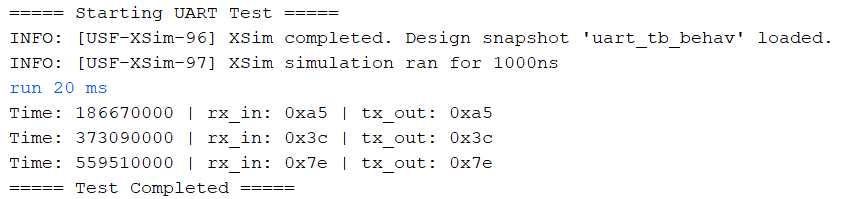 
The following image shows the outputs of the uart module. The testbench used the rx_in register to input bits to the uart which
the module outputs. The results show the input and outputs are the same which is the expected behavior.
## Timing Analysis Report and Clock Constrain
### 100 MHz Clock
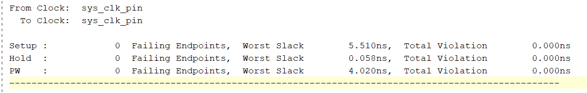
### 200 MHz Clock
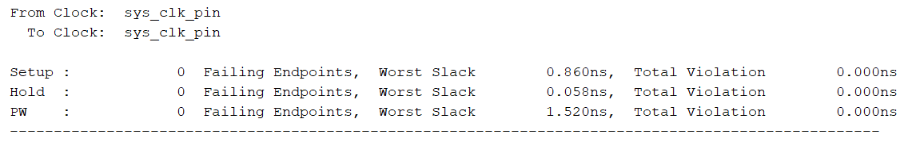 
The slack for the 200 Mhz clock is less. This makes sense because the clock is faster so there less time for extra delays. A faster time overall
makes it so there is less time for delays.

